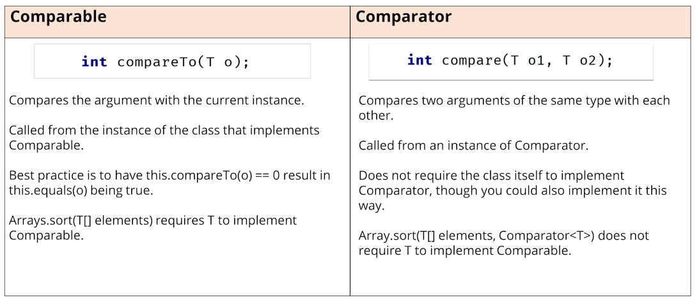

# Java

<p align="center">

</p>


- Oriented Programing Language
- Multiplatform (Write only, run anywhere)
- Compiled/Interpreted language

## JVM

The JVM, or Java Virtual Machine, is a crucial component of the Java platform.
It's responsible for executing Java bytecode, making Java applications 
platform-independent by translating code into machine-specific instructions 
at runtime. This enables "write once, run anywhere" compatibility and
efficient memory management.


## JRE x JDK

1. **JRE (Java Runtime Environment)**: It's the environment needed to run Java applications. 
It includes the JVM, class libraries, and essential runtime components,
but doesn't have development tools like compilers.

2. **JDK (Java Development Kit)**: The JDK is for Java developers.
It includes the JRE along with tools like compilers and debuggers, 
allowing programmers to develop and build Java applications.


## Run Java code

Class must contain `main` method.

```shell
java [Class].java
```

## Primitive Data Types


| Type    | Size    |Description|
|---------|---------| --------- |
| byte    | 1 byte  | Stores whole numbers from -128 to 127 | 
| short   | 2 bytes | Stores whole numbers from -32,768 to 32,767 |
| int     | 4 bytes | Stores whole numbers from -2,147,483,648 to 2,147,483,647 |
| long    | 8 bytes | Stores whole numbers from -9,223,372,036,854,775,808 to 9,223,372,036,854,775,807 |
| float   | 4 byte  | 	Stores fractional numbers. Sufficient for storing 6 to 7 decimal digits |
| double  | 8 byte  | Stores fractional numbers. Sufficient for storing 15 decimal digits |
| boolean | 1 byte  | 	Stores true or false values |
| chat    | 2 byte  | Stores a single character/letter or ASCII values |


## Arrays

Java arrays are immutable, the variable store the reference of array.
So, for copy the values and not the reference use `Arrays.copyOf()`.

This ll thrown an `ArrayIndexOutOfBoundsException`.

```java
int[] array = {1, 2, 3, 4, 5};
array[5] = 55;
```

Instead of use `[]` its also possible use `...`, in this case you can pass a single
instance of the required type, not an array.

```java
void printText(String[] texts) {
    for (String s: texts) {
        System.out.println(s);
    }
}

printText("World"); // There`s an error!
```

```java
void printText(String... texts) {
    for (String s: texts) {
        System.out.println(s);
    }
}

printText("World"); // Works fine!
```

### Generics

Generics in Java are a powerful feature that enable types (classes and interfaces) to 
be parameters when defining classes, interfaces, and methods.
Much like the more familiar formal parameters used in method declarations,
type parameters provide a way for you to re-use the same code with different inputs.
The main benefits of generics include stronger type checks at compile time,
elimination of casts, and the ability to implement generic algorithms.

```java
class GenericClass<T> {
    public T field;
}
```

Parameterized type T must be a Player, or a subtype of Player:

```java
public class Team<T extends Player> {}
```

### Comparable

The Comparable interface in Java is a mechanism for defining the natural ordering of objects of a class. 
When a class implements the Comparable interface, it agrees to implement the compareTo method,
which compares the current object with another object of the same type. The compareTo method returns an
integer value: negative if the current object is less than the specified object, zero if they are equal, 
and positive if the current object is greater than the specified object. This interface is part of
the java.lang package, which means it's automatically available and does not need to be imported.

```java
Integer five = 5;
Integer[] others = {0, 5, 10, -5};

for(Integer i: others) {
    five.compareTo(i);    
}
```

### Comparator

The Comparator interface in Java is used to define a custom ordering for objects of a class that may not have a
natural ordering, or when you need an alternative ordering to the one defined by a class's
Comparable implementation. Unlike Comparable, which is a method implemented within the class of
the objects to be compared, Comparator is external to the objects being compared. This approach provides
flexibility, allowing multiple different comparison strategies for the same class.

