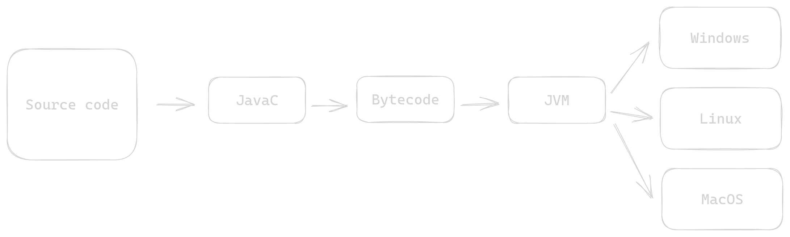
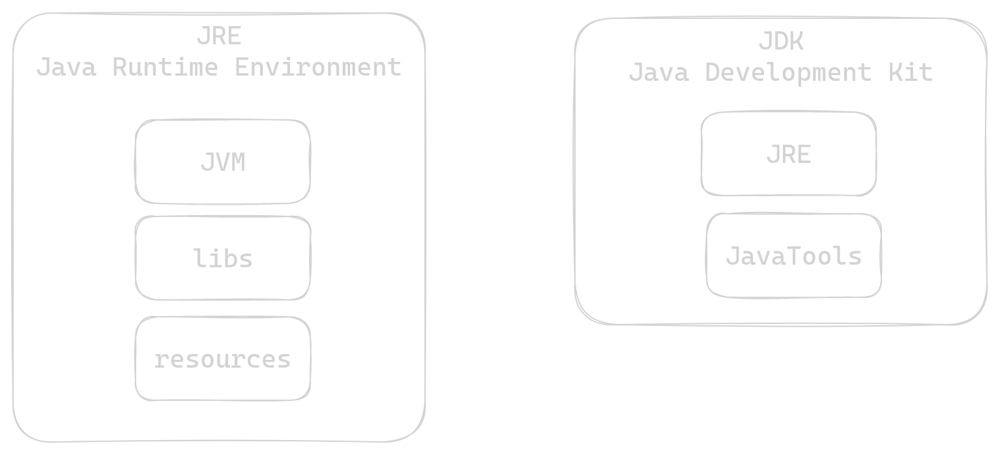

# Java


- Oriented Programing Language
- Multiplatform (Write only, run anywhere)
- Compiled/Interpreted language

## JVM

The JVM, or Java Virtual Machine, is a crucial component of the Java platform.
It's responsible for executing Java bytecode, making Java applications 
platform-independent by translating code into machine-specific instructions 
at runtime. This enables "write once, run anywhere" compatibility and
efficient memory management.




## JRE x JDK

1. **JRE (Java Runtime Environment)**: It's the environment needed to run Java applications. 
It includes the JVM, class libraries, and essential runtime components,
but doesn't have development tools like compilers.

2. **JDK (Java Development Kit)**: The JDK is for Java developers.
It includes the JRE along with tools like compilers and debuggers, 
allowing programmers to develop and build Java applications.



## Run Java code

Class must contain `main` method.

```shell
java [Class].java
```

